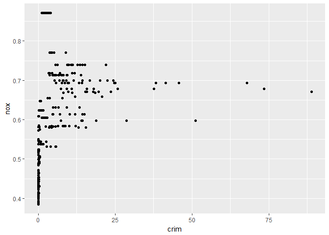
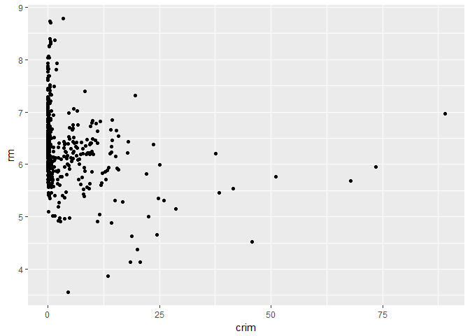
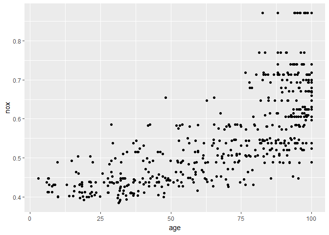
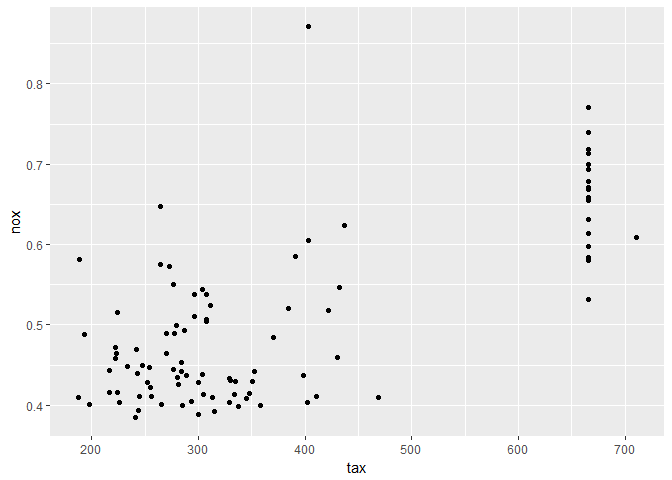
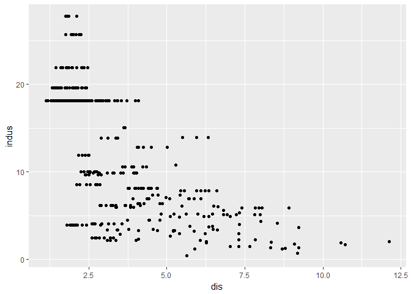

# islr assignment 1
Mitch Borgert  
2/26/18  


```r
library(MASS)
```

```
## Warning: package 'MASS' was built under R version 3.4.3
```

```r
library(dplyr)
```

```
## 
## Attaching package: 'dplyr'
```

```
## The following object is masked from 'package:MASS':
## 
##     select
```

```
## The following objects are masked from 'package:stats':
## 
##     filter, lag
```

```
## The following objects are masked from 'package:base':
## 
##     intersect, setdiff, setequal, union
```

```r
library(ggplot2)

bos = Boston
```


#1.
  
  a. Since the sample size is large there will be a smaller variance. We can use a flexible method here since we are starting with a low variance.
  
  b. Since the variance will be high for this sample, we should use a less flexible method so we dont significantly increase the variance. 
  
  c. Since the relationship is nonlinear we should use a more flexible method since linear regression is not very flexible. 
  
  d. Since the variance of the error terms is high we should use a less flexible method so we don't significantly increase the variance. 
  

#2.
  
  a. We would use regression and are interested in inference. P is the ceos' salary and N is the firms. 
  
  b. This is a classification problem and we are interested in prediction. P is success/failure and N is the sample products. 
  
  c. This is a regression problem and we are interested om prediction. P is % change in the USD/Euro market and n would be the stock market data. 
  
#4. 

  a. One example would be a state voting for one political party or the other. The response would be how they vote and the predictors could be demographics or a survey or responses. Our goal would be prediction. Another example could be predicting if opening a store will get customers. The response would be yes or no and the predictors could be the success of other stores in the area. Our goal would be prediction. A final example could be predicting if students will pass a class. The response will be yes or no and the predictors could be previous grades. 
  
  b. We could use regression to predict the height that plants grow based on how much nitrogen they reciece. The response would be height and the predictors would be nitrogen amount. This would be a prediction problem. Another example of regression would be predicting the age that someone starts smoking. The age would be the response and a bunch of demographics could be the predictors. One more use of regression would be predicting future salary. Salary would be the response and the predictors could be education, current salary, and seniority. 
  
  c. You could use cluster sampling when try to see how good students grades are. The clusters can be by freshman, sophomore, junior, senior, and graduate. The response would be grades and the predictors would be major and demographic variables. Another could be if a disease effects some trees. One cluster could trees near water and the other could be trees surrounded by land. The response would be if it is diseased and the predictors could be location, type of tree, and age. One more example could be predicting how much money people spend at a business. The clusters could be by groups of income. The response would be how much they spend and the predictors would be demographic variables and how much they go shopping.  
  
  
  
#10 b. 

```r
ggplot(data=bos,aes(x=crim,y=nox)) + geom_point()
```

<!-- -->

```r
ggplot(data=bos,aes(x=crim,y=rm)) + geom_point()
```

<!-- -->

```r
ggplot(data=bos,aes(x=age,y=nox)) + geom_point()
```

<!-- -->

```r
ggplot(data=bos,aes(x=tax,y=nox)) + geom_point()
```

<!-- -->

```r
ggplot(data=bos,aes(x=dis,y=indus)) + geom_point()
```

<!-- -->

It looks like as the age of the home increase, the nitrogen oxide concentration increases. As tax increases, so does nitrogen oxide, it appears. As the distance from 5 Boston employment centers increases, the proportion of non-retail busnesses decreases. 

#c. 

```r
ggplot(data=bos,aes(x=dis,y=crim)) + geom_point()
```

<!-- -->

As distance from employment centers increases, crime looks like it decreases. 

#d. 

```r
zmsummary = bos %>% group_by(zn) %>% summarise(mcrime = mean(crim), mtax = mean(tax), mptratio = mean(ptratio))
zmsummary
```

```
## # A tibble: 26 x 4
##       zn     mcrime     mtax mptratio
##    <dbl>      <dbl>    <dbl>    <dbl>
##  1   0.0 4.86848648 449.1828 19.05780
##  2  12.5 0.13718500 321.2000 16.31000
##  3  17.5 0.01951000 216.0000 18.60000
##  4  18.0 0.00632000 296.0000 15.30000
##  5  20.0 0.41906952 245.0952 14.69524
##  6  21.0 0.05887750 243.0000 16.80000
##  7  22.0 0.20944700 330.0000 19.10000
##  8  25.0 0.09733800 282.8000 19.42000
##  9  28.0 0.03790667 270.0000 18.20000
## 10  30.0 0.10414000 300.0000 16.60000
## # ... with 16 more rows
```

Zone 20 has high crime, zone 45 has high tax, and zones 22 and 25 have a high ptratio. 

#e. 

```r
zmsummary2 = bos %>% group_by(zn) %>% summarise(charles = mean(chas))
zmsummary2
```

```
## # A tibble: 26 x 2
##       zn    charles
##    <dbl>      <dbl>
##  1   0.0 0.07526882
##  2  12.5 0.00000000
##  3  17.5 0.00000000
##  4  18.0 0.00000000
##  5  20.0 0.14285714
##  6  21.0 0.00000000
##  7  22.0 0.00000000
##  8  25.0 0.00000000
##  9  28.0 0.00000000
## 10  30.0 0.00000000
## # ... with 16 more rows
```
Zone 20, 40, and 90 bound the charles river. 

#f. 

```r
median(bos$ptratio)
```

```
## [1] 19.05
```

The median ptratio is 19.05. 

#g. 

```r
zmsummary3 = bos %>% group_by(zn) %>% summarise(mvo = median(medv))
zmsummary3
```

```
## # A tibble: 26 x 2
##       zn   mvo
##    <dbl> <dbl>
##  1   0.0 19.75
##  2  12.5 19.90
##  3  17.5 33.00
##  4  18.0 24.00
##  5  20.0 35.20
##  6  21.0 21.95
##  7  22.0 24.45
##  8  25.0 23.10
##  9  28.0 22.90
## 10  30.0 22.75
## # ... with 16 more rows
```

```r
bos35 = bos %>% filter(zn == 35) %>% group_by(zn) %>% summarise(mcrim = mean(crim),mindus = mean(indus),mnox = mean(nox), mage= mean(age))
bos35
```

```
## # A tibble: 1 x 5
##      zn      mcrim   mindus      mnox     mage
##   <dbl>      <dbl>    <dbl>     <dbl>    <dbl>
## 1    35 0.03263333 4.546667 0.4392667 33.66667
```


Zone 35 has the lowest median value of owner occupied homes. Mean crime is low, mean industrial proportion is 4.5. Mean nitrogen is .43. Mean age is 33.66.

#h.

```r
zmsummary4 = bos %>% group_by(zn) %>% summarise(mrm = mean(rm))
zmsummary4
```

```
## # A tibble: 26 x 2
##       zn      mrm
##    <dbl>    <dbl>
##  1   0.0 6.147922
##  2  12.5 5.945100
##  3  17.5 7.104000
##  4  18.0 6.575000
##  5  20.0 7.160190
##  6  21.0 6.146750
##  7  22.0 6.482400
##  8  25.0 6.281200
##  9  28.0 6.300667
## 10  30.0 6.471667
## # ... with 16 more rows
```

24 zones average more than 6 rooms per dwelling. None average more than 8 per dwelling, so I must have done something wrong but am unsure. 


