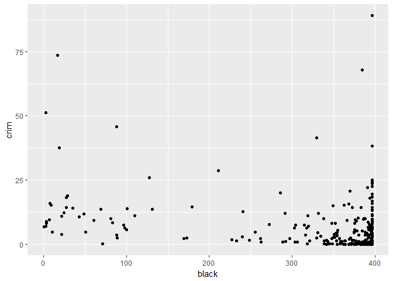
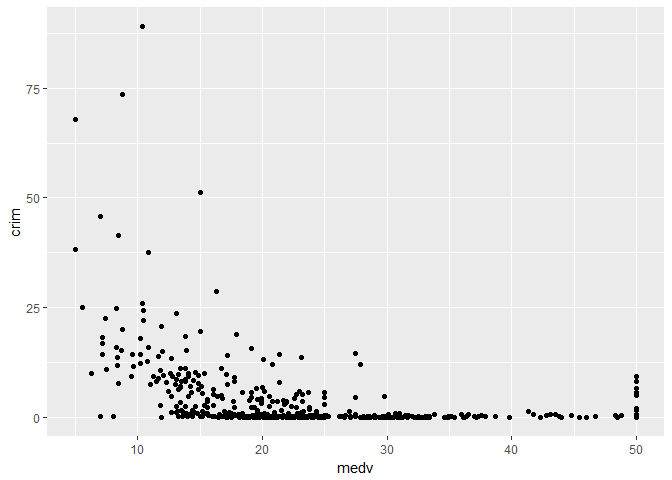
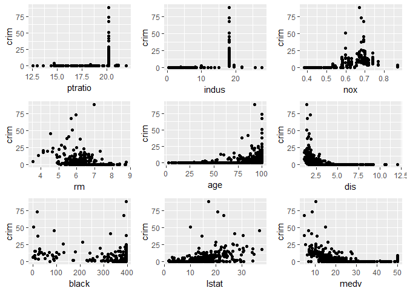
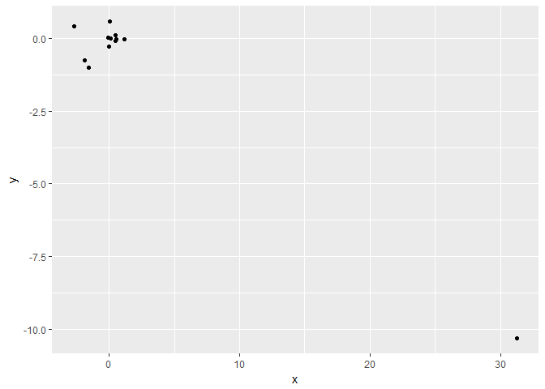

# islr hw 2
mitch borgert  
March 4, 2018  


#4
a. Since the relationship is linear we would expect the RSS to be close to 0. Then we would expect the cubic regression RSS to be higher since the true relationship is linear. 

b. We are not sure since the test data could have a different relatiion ship from the training data.

c. I dont think that there is enough information to determine which RSS is lower since we do not know the realationship of the data. 

d. Once again, we don't know for the same reason as above. 


#15


```r
lm1 = lm(crim~zn,data=bos)
pander(summary(lm1))
```


---------------------------------------------------------------
     &nbsp;        Estimate   Std. Error   t value   Pr(>|t|)  
----------------- ---------- ------------ --------- -----------
 **(Intercept)**    4.454       0.4172      10.67    4.038e-24 

     **zn**        -0.07393    0.01609     -4.594    5.506e-06 
---------------------------------------------------------------


---------------------------------------------------------------
 Observations   Residual Std. Error    $R^2$    Adjusted $R^2$ 
-------------- --------------------- --------- ----------------
     506               8.435          0.04019      0.03828     
---------------------------------------------------------------

Table: Fitting linear model: crim ~ zn

```r
lm2 = lm(crim~indus,data=bos)
pander(summary(lm2))
```


--------------------------------------------------------------
     &nbsp;        Estimate   Std. Error   t value   Pr(>|t|) 
----------------- ---------- ------------ --------- ----------
 **(Intercept)**    -2.064      0.6672     -3.093    0.002091 

    **indus**       0.5098     0.05102      9.991    1.45e-21 
--------------------------------------------------------------


--------------------------------------------------------------
 Observations   Residual Std. Error   $R^2$    Adjusted $R^2$ 
-------------- --------------------- -------- ----------------
     506               7.866          0.1653       0.1637     
--------------------------------------------------------------

Table: Fitting linear model: crim ~ indus

```r
a2 = ggplot(bos,aes(x=indus,y=crim))+geom_point()

lm3 = lm(crim~chas,data=bos)
pander(summary(lm3))
```


--------------------------------------------------------------
     &nbsp;        Estimate   Std. Error   t value   Pr(>|t|) 
----------------- ---------- ------------ --------- ----------
 **(Intercept)**    3.744       0.3961      9.453    1.24e-19 

    **chas**        -1.893      1.506      -1.257     0.2094  
--------------------------------------------------------------


----------------------------------------------------------------
 Observations   Residual Std. Error    $R^2$     Adjusted $R^2$ 
-------------- --------------------- ---------- ----------------
     506               8.597          0.003124      0.001146    
----------------------------------------------------------------

Table: Fitting linear model: crim ~ chas

```r
lm4 = lm(crim~nox,data=bos)
pander(summary(lm4))
```


---------------------------------------------------------------
     &nbsp;        Estimate   Std. Error   t value   Pr(>|t|)  
----------------- ---------- ------------ --------- -----------
 **(Intercept)**    -13.72      1.699      -8.073    5.077e-15 

     **nox**        31.25       2.999       10.42    3.752e-23 
---------------------------------------------------------------


--------------------------------------------------------------
 Observations   Residual Std. Error   $R^2$    Adjusted $R^2$ 
-------------- --------------------- -------- ----------------
     506               7.81           0.1772       0.1756     
--------------------------------------------------------------

Table: Fitting linear model: crim ~ nox

```r
a3 = ggplot(bos,aes(x=nox,y=crim))+geom_point()

lm5 = lm(crim~rm,data=bos)
pander(summary(lm5))
```


---------------------------------------------------------------
     &nbsp;        Estimate   Std. Error   t value   Pr(>|t|)  
----------------- ---------- ------------ --------- -----------
 **(Intercept)**    20.48       3.364       6.088    2.272e-09 

     **rm**         -2.684      0.532      -5.045    6.347e-07 
---------------------------------------------------------------


---------------------------------------------------------------
 Observations   Residual Std. Error    $R^2$    Adjusted $R^2$ 
-------------- --------------------- --------- ----------------
     506               8.401          0.04807      0.04618     
---------------------------------------------------------------

Table: Fitting linear model: crim ~ rm

```r
a4 = ggplot(bos,aes(x=rm,y=crim))+geom_point()

lm6 = lm(crim~age,data=bos)
pander(summary(lm6))
```


---------------------------------------------------------------
     &nbsp;        Estimate   Std. Error   t value   Pr(>|t|)  
----------------- ---------- ------------ --------- -----------
 **(Intercept)**    -3.778      0.944      -4.002    7.222e-05 

     **age**        0.1078     0.01274      8.463    2.855e-16 
---------------------------------------------------------------


--------------------------------------------------------------
 Observations   Residual Std. Error   $R^2$    Adjusted $R^2$ 
-------------- --------------------- -------- ----------------
     506               8.057          0.1244       0.1227     
--------------------------------------------------------------

Table: Fitting linear model: crim ~ age

```r
a5 = ggplot(bos,aes(x=age,y=crim))+geom_point()

lm7 = lm(crim~dis,data=bos)
pander(summary(lm7))
```


---------------------------------------------------------------
     &nbsp;        Estimate   Std. Error   t value   Pr(>|t|)  
----------------- ---------- ------------ --------- -----------
 **(Intercept)**    9.499       0.7304      13.01    1.503e-33 

     **dis**        -1.551      0.1683     -9.213    8.52e-19  
---------------------------------------------------------------


--------------------------------------------------------------
 Observations   Residual Std. Error   $R^2$    Adjusted $R^2$ 
-------------- --------------------- -------- ----------------
     506               7.965          0.1441       0.1425     
--------------------------------------------------------------

Table: Fitting linear model: crim ~ dis

```r
a6 = ggplot(bos,aes(x=dis,y=crim))+geom_point()

lm8 = lm(crim~tax,data=bos)
pander(summary(lm8))
```


---------------------------------------------------------------
     &nbsp;        Estimate   Std. Error   t value   Pr(>|t|)  
----------------- ---------- ------------ --------- -----------
 **(Intercept)**    -8.528      0.8158     -10.45    2.774e-23 

     **tax**       0.02974     0.001847     16.1     2.357e-47 
---------------------------------------------------------------


--------------------------------------------------------------
 Observations   Residual Std. Error   $R^2$    Adjusted $R^2$ 
-------------- --------------------- -------- ----------------
     506               6.997          0.3396       0.3383     
--------------------------------------------------------------

Table: Fitting linear model: crim ~ tax

```r
lm9 = lm(crim~ptratio,data=bos)
pander(summary(lm9))
```


---------------------------------------------------------------
     &nbsp;        Estimate   Std. Error   t value   Pr(>|t|)  
----------------- ---------- ------------ --------- -----------
 **(Intercept)**    -17.65      3.147      -5.607    3.395e-08 

   **ptratio**      1.152       0.1694      6.801    2.943e-11 
---------------------------------------------------------------


---------------------------------------------------------------
 Observations   Residual Std. Error    $R^2$    Adjusted $R^2$ 
-------------- --------------------- --------- ----------------
     506               8.24           0.08407      0.08225     
---------------------------------------------------------------

Table: Fitting linear model: crim ~ ptratio

```r
a1 = ggplot(bos,aes(x=ptratio,y=crim))+geom_point()

lm10 = lm(crim~black,data=bos)
pander(summary(lm10))
```


---------------------------------------------------------------
     &nbsp;        Estimate   Std. Error   t value   Pr(>|t|)  
----------------- ---------- ------------ --------- -----------
 **(Intercept)**    16.55       1.426       11.61    8.922e-28 

    **black**      -0.03628    0.003873    -9.367    2.487e-19 
---------------------------------------------------------------


--------------------------------------------------------------
 Observations   Residual Std. Error   $R^2$    Adjusted $R^2$ 
-------------- --------------------- -------- ----------------
     506               7.946          0.1483       0.1466     
--------------------------------------------------------------

Table: Fitting linear model: crim ~ black

```r
a7 = ggplot(bos,aes(x=black,y=crim))+geom_point()
a7
```

<!-- -->

```r
lm11 = lm(crim~lstat,data=bos)
pander(summary(lm11))
```


---------------------------------------------------------------
     &nbsp;        Estimate   Std. Error   t value   Pr(>|t|)  
----------------- ---------- ------------ --------- -----------
 **(Intercept)**    -3.331      0.6938     -4.801    2.087e-06 

    **lstat**       0.5488     0.04776      11.49    2.654e-27 
---------------------------------------------------------------


--------------------------------------------------------------
 Observations   Residual Std. Error   $R^2$    Adjusted $R^2$ 
-------------- --------------------- -------- ----------------
     506               7.664          0.2076       0.206      
--------------------------------------------------------------

Table: Fitting linear model: crim ~ lstat

```r
a8 = ggplot(bos,aes(x=lstat,y=crim))+geom_point()

lm12 = lm(crim~medv,data=bos)
pander(summary(lm12))
```


---------------------------------------------------------------
     &nbsp;        Estimate   Std. Error   t value   Pr(>|t|)  
----------------- ---------- ------------ --------- -----------
 **(Intercept)**     11.8       0.9342      12.63    5.934e-32 

    **medv**       -0.3632     0.03839      -9.46    1.174e-19 
---------------------------------------------------------------


--------------------------------------------------------------
 Observations   Residual Std. Error   $R^2$    Adjusted $R^2$ 
-------------- --------------------- -------- ----------------
     506               7.934          0.1508       0.1491     
--------------------------------------------------------------

Table: Fitting linear model: crim ~ medv

```r
a9 = ggplot(bos,aes(x=medv,y=crim))+geom_point()
a9
```

<!-- -->

```r
grid.arrange(a1,a2,a3,a4,a5,a6,a7,a8,a9)
```

<!-- -->

It looks like there is an association with all of the predictors, however some of them dont make much since. Some of the predictors had the vast majority at one value so it looks like crime would be significant when compared to other values. I think that nox,rm,age,dis,lstat, and medv are significant. The graph for black looks like it is insignificant. Ptratio and indus are both of the type that doesn't make sense. 


```r
bigone = lm(crim~zn+indus+chas+nox+rm+age+dis+rad+tax+ptratio+black+lstat+medv,data=bos)
pander(summary(bigone))
```


----------------------------------------------------------------
     &nbsp;        Estimate    Std. Error   t value   Pr(>|t|)  
----------------- ----------- ------------ --------- -----------
 **(Intercept)**     17.03       7.235       2.354     0.01895  

     **zn**         0.04486     0.01873      2.394     0.01702  

    **indus**      -0.06385     0.08341     -0.7656    0.4443   

    **chas**        -0.7491       1.18      -0.6348    0.5259   

     **nox**        -10.31       5.276      -1.955     0.05115  

     **rm**         0.4301       0.6128     0.7019     0.4831   

     **age**       0.001452     0.01793     0.08098    0.9355   

     **dis**        -0.9872      0.2818     -3.503    0.0005022 

     **rad**        0.5882      0.08805      6.68     6.46e-11  

     **tax**       -0.00378     0.005156    -0.7332    0.4638   

   **ptratio**      -0.2711      0.1865     -1.454     0.1466   

    **black**      -0.007538    0.003673    -2.052     0.0407   

    **lstat**       0.1262      0.07572      1.667     0.09621  

    **medv**        -0.1989     0.06052     -3.287    0.001087  
----------------------------------------------------------------


-------------------------------------------------------------
 Observations   Residual Std. Error   $R^2$   Adjusted $R^2$ 
-------------- --------------------- ------- ----------------
     506               6.439          0.454       0.4396     
-------------------------------------------------------------

Table: Fitting linear model: crim ~ zn + indus + chas + nox + rm + age + dis + rad + tax + ptratio + black + lstat + medv

It seems that indus, chas, rm, age,tax, and ptratio are all insignificant. 


```r
x = c(lm1$coefficients[2],lm2$coefficients[2],lm3$coefficients[2],lm4$coefficients[2],lm5$coefficients[2],lm6$coefficients[2],lm7$coefficients[2],lm8$coefficients[2],lm9$coefficients[2],lm10$coefficients[2],lm11$coefficients[2],lm2$coefficients[2])
x = as.numeric(x)

y = bigone$coefficients[2:13]
y=as.numeric(y)

df = data.frame(x,y)

ggplot(df,aes(x=x,y=y))+geom_point()
```

<!-- -->


```r
lmm = lm(crim~poly(zn,3),data=bos)
pander(summary(lmm))
```


----------------------------------------------------------------
      &nbsp;        Estimate   Std. Error   t value   Pr(>|t|)  
------------------ ---------- ------------ --------- -----------
 **(Intercept)**     3.614       0.3722      9.709    1.547e-20 

 **poly(zn, 3)1**    -38.75      8.372      -4.628    4.698e-06 

 **poly(zn, 3)2**    23.94       8.372       2.859    0.004421  

 **poly(zn, 3)3**    -10.07      8.372      -1.203     0.2295   
----------------------------------------------------------------


---------------------------------------------------------------
 Observations   Residual Std. Error    $R^2$    Adjusted $R^2$ 
-------------- --------------------- --------- ----------------
     506               8.372          0.05824      0.05261     
---------------------------------------------------------------

Table: Fitting linear model: crim ~ poly(zn, 3)

```r
lmm2 = lm(crim~poly(indus,3),data=bos)
pander(summary(lmm2))
```


-------------------------------------------------------------------
       &nbsp;          Estimate   Std. Error   t value   Pr(>|t|)  
--------------------- ---------- ------------ --------- -----------
   **(Intercept)**      3.614        0.33       10.95    3.606e-25 

 **poly(indus, 3)1**    78.59       7.423       10.59    8.854e-24 

 **poly(indus, 3)2**    -24.39      7.423      -3.286    0.001086  

 **poly(indus, 3)3**    -54.13      7.423      -7.292    1.196e-12 
-------------------------------------------------------------------


--------------------------------------------------------------
 Observations   Residual Std. Error   $R^2$    Adjusted $R^2$ 
-------------- --------------------- -------- ----------------
     506               7.423          0.2597       0.2552     
--------------------------------------------------------------

Table: Fitting linear model: crim ~ poly(indus, 3)

```r
lmm3 = lm(crim~poly(nox,3),data=bos)
pander(summary(lmm3))
```


-----------------------------------------------------------------
      &nbsp;         Estimate   Std. Error   t value   Pr(>|t|)  
------------------- ---------- ------------ --------- -----------
  **(Intercept)**     3.614       0.3216      11.24    2.743e-26 

 **poly(nox, 3)1**    81.37       7.234       11.25    2.457e-26 

 **poly(nox, 3)2**    -28.83      7.234      -3.985    7.737e-05 

 **poly(nox, 3)3**    -60.36      7.234      -8.345    6.961e-16 
-----------------------------------------------------------------


-------------------------------------------------------------
 Observations   Residual Std. Error   $R^2$   Adjusted $R^2$ 
-------------- --------------------- ------- ----------------
     506               7.234          0.297       0.2928     
-------------------------------------------------------------

Table: Fitting linear model: crim ~ poly(nox, 3)

```r
lmm4 = lm(crim~poly(rm,3),data=bos)
pander(summary(lmm4))
```


----------------------------------------------------------------
      &nbsp;        Estimate   Std. Error   t value   Pr(>|t|)  
------------------ ---------- ------------ --------- -----------
 **(Intercept)**     3.614       0.3703      9.758    1.027e-20 

 **poly(rm, 3)1**    -42.38       8.33      -5.088    5.128e-07 

 **poly(rm, 3)2**    26.58        8.33       3.191    0.001509  

 **poly(rm, 3)3**    -5.51        8.33      -0.6615    0.5086   
----------------------------------------------------------------


---------------------------------------------------------------
 Observations   Residual Std. Error    $R^2$    Adjusted $R^2$ 
-------------- --------------------- --------- ----------------
     506               8.33           0.06779      0.06222     
---------------------------------------------------------------

Table: Fitting linear model: crim ~ poly(rm, 3)

```r
lmm5 = lm(crim~poly(age,3),data=bos)
pander(summary(lmm5))
```


-----------------------------------------------------------------
      &nbsp;         Estimate   Std. Error   t value   Pr(>|t|)  
------------------- ---------- ------------ --------- -----------
  **(Intercept)**     3.614       0.3485      10.37    5.919e-23 

 **poly(age, 3)1**    68.18        7.84       8.697    4.879e-17 

 **poly(age, 3)2**    37.48        7.84       4.781    2.291e-06 

 **poly(age, 3)3**    21.35        7.84       2.724     0.00668  
-----------------------------------------------------------------


--------------------------------------------------------------
 Observations   Residual Std. Error   $R^2$    Adjusted $R^2$ 
-------------- --------------------- -------- ----------------
     506               7.84           0.1742       0.1693     
--------------------------------------------------------------

Table: Fitting linear model: crim ~ poly(age, 3)

```r
lmm6 = lm(crim~poly(dis,3),data=bos)
pander(summary(lmm6))
```


-----------------------------------------------------------------
      &nbsp;         Estimate   Std. Error   t value   Pr(>|t|)  
------------------- ---------- ------------ --------- -----------
  **(Intercept)**     3.614       0.3259      11.09    1.06e-25  

 **poly(dis, 3)1**    -73.39      7.331      -10.01    1.253e-21 

 **poly(dis, 3)2**    56.37       7.331       7.689    7.87e-14  

 **poly(dis, 3)3**    -42.62      7.331      -5.814    1.089e-08 
-----------------------------------------------------------------


--------------------------------------------------------------
 Observations   Residual Std. Error   $R^2$    Adjusted $R^2$ 
-------------- --------------------- -------- ----------------
     506               7.331          0.2778       0.2735     
--------------------------------------------------------------

Table: Fitting linear model: crim ~ poly(dis, 3)

```r
lmm7 = lm(crim~poly(rad,3),data=bos)
pander(summary(lmm7))
```


-----------------------------------------------------------------
      &nbsp;         Estimate   Std. Error   t value   Pr(>|t|)  
------------------- ---------- ------------ --------- -----------
  **(Intercept)**     3.614       0.2971      12.16    5.15e-30  

 **poly(rad, 3)1**    120.9       6.682       18.09    1.053e-56 

 **poly(rad, 3)2**    17.49       6.682       2.618    0.009121  

 **poly(rad, 3)3**    4.698       6.682      0.7031     0.4823   
-----------------------------------------------------------------


-------------------------------------------------------------
 Observations   Residual Std. Error   $R^2$   Adjusted $R^2$ 
-------------- --------------------- ------- ----------------
     506               6.682           0.4        0.3965     
-------------------------------------------------------------

Table: Fitting linear model: crim ~ poly(rad, 3)

```r
lmm8 = lm(crim~poly(tax,3),data=bos)
pander(summary(lmm8))
```


-----------------------------------------------------------------
      &nbsp;         Estimate   Std. Error   t value   Pr(>|t|)  
------------------- ---------- ------------ --------- -----------
  **(Intercept)**     3.614       0.3047      11.86    8.956e-29 

 **poly(tax, 3)1**    112.6       6.854       16.44    6.976e-49 

 **poly(tax, 3)2**    32.09       6.854       4.682    3.665e-06 

 **poly(tax, 3)3**    -7.997      6.854      -1.167     0.2439   
-----------------------------------------------------------------


--------------------------------------------------------------
 Observations   Residual Std. Error   $R^2$    Adjusted $R^2$ 
-------------- --------------------- -------- ----------------
     506               6.854          0.3689       0.3651     
--------------------------------------------------------------

Table: Fitting linear model: crim ~ poly(tax, 3)

```r
lmm9 = lm(crim~poly(ptratio,3),data=bos)
pander(summary(lmm9))
```


---------------------------------------------------------------------
        &nbsp;           Estimate   Std. Error   t value   Pr(>|t|)  
----------------------- ---------- ------------ --------- -----------
    **(Intercept)**       3.614       0.361       10.01    1.271e-21 

 **poly(ptratio, 3)1**    56.05       8.122       6.901    1.565e-11 

 **poly(ptratio, 3)2**    24.77       8.122       3.05     0.002405  

 **poly(ptratio, 3)3**    -22.28      8.122      -2.743    0.006301  
---------------------------------------------------------------------


--------------------------------------------------------------
 Observations   Residual Std. Error   $R^2$    Adjusted $R^2$ 
-------------- --------------------- -------- ----------------
     506               8.122          0.1138       0.1085     
--------------------------------------------------------------

Table: Fitting linear model: crim ~ poly(ptratio, 3)

```r
lmm10 = lm(crim~poly(black,3),data=bos)
pander(summary(lmm10))
```


------------------------------------------------------------------
       &nbsp;          Estimate   Std. Error   t value   Pr(>|t|) 
--------------------- ---------- ------------ --------- ----------
   **(Intercept)**      3.614       0.3536      10.22    2.14e-22 

 **poly(black, 3)1**    -74.43      7.955      -9.357    2.73e-19 

 **poly(black, 3)2**    5.926       7.955       0.745     0.4566  

 **poly(black, 3)3**    -4.835      7.955      -0.6078    0.5436  
------------------------------------------------------------------


--------------------------------------------------------------
 Observations   Residual Std. Error   $R^2$    Adjusted $R^2$ 
-------------- --------------------- -------- ----------------
     506               7.955          0.1498       0.1448     
--------------------------------------------------------------

Table: Fitting linear model: crim ~ poly(black, 3)

```r
lmm11 = lm(crim~poly(lstat,3),data=bos)
pander(summary(lmm11))
```


-------------------------------------------------------------------
       &nbsp;          Estimate   Std. Error   t value   Pr(>|t|)  
--------------------- ---------- ------------ --------- -----------
   **(Intercept)**      3.614       0.3392      10.65    4.939e-24 

 **poly(lstat, 3)1**    88.07       7.629       11.54    1.678e-27 

 **poly(lstat, 3)2**    15.89       7.629       2.082     0.0378   

 **poly(lstat, 3)3**    -11.57      7.629      -1.517     0.1299   
-------------------------------------------------------------------


--------------------------------------------------------------
 Observations   Residual Std. Error   $R^2$    Adjusted $R^2$ 
-------------- --------------------- -------- ----------------
     506               7.629          0.2179       0.2133     
--------------------------------------------------------------

Table: Fitting linear model: crim ~ poly(lstat, 3)

```r
lmm12 = lm(crim~poly(medv,3),data=bos)
pander(summary(lmm12))
```


------------------------------------------------------------------
       &nbsp;         Estimate   Std. Error   t value   Pr(>|t|)  
-------------------- ---------- ------------ --------- -----------
  **(Intercept)**      3.614       0.292       12.37    7.024e-31 

 **poly(medv, 3)1**    -75.06      6.569      -11.43    4.931e-27 

 **poly(medv, 3)2**    88.09       6.569       13.41    2.929e-35 

 **poly(medv, 3)3**    -48.03      6.569      -7.312    1.047e-12 
------------------------------------------------------------------


--------------------------------------------------------------
 Observations   Residual Std. Error   $R^2$    Adjusted $R^2$ 
-------------- --------------------- -------- ----------------
     506               6.569          0.4202       0.4167     
--------------------------------------------------------------

Table: Fitting linear model: crim ~ poly(medv, 3)

There is evidence of a non-linear relationship for up to 2 for zn, indus, nox, up to 2 for rm, age, dis, up to 2 for rad, up to 2 for tax, ptratio, up to 2 for lstat, and medv. 


